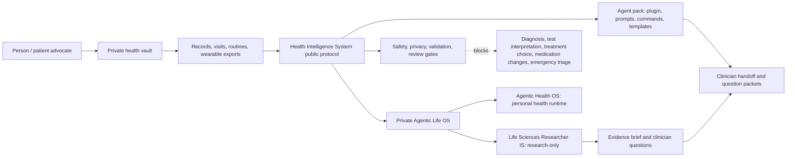

<p align="center">
  
</p>

<h1 align="center">Health Intelligence System</h1>

<p align="center">
  A public, safety-gated protocol and agent pack for private health operations, clinician-ready handoffs, wearable-data organization, cancer-prep workflows, and research-boundary discipline.
</p>

<p align="center">
  <a href="https://github.com/frankxai/health-intelligence-system/releases/tag/v0.2.1"></a>
  <a href="LICENSE"></a>
  <a href="SAFETY.md"></a>
  <a href="VERIFY.md"></a>
  <a href="AGENT_PACK.md"></a>
</p>

<p align="center">
  <a href="https://github.com/frankxai/health-intelligence-system/releases/download/v0.2.1/health-intelligence-system-v0.2.1.zip">Download full package</a>
  ·
  <a href="https://github.com/frankxai/health-intelligence-system/releases/download/v0.2.1/health-intelligence-agent-pack-v0.2.1.zip">Download agent pack</a>
  ·
  <a href="QUICK-START.md">Quick start</a>
  ·
  <a href="SAFETY.md">Safety</a>
  ·
  <a href="MARKETPLACE.md">Distribution</a>
</p>

## What This Is

Health Intelligence System is a public protocol layer for becoming a better health operator and patient advocate. It helps organize private records, wearable exports, doctor visits, clinician questions, evidence sources, cancer-prep workflows, and AI-assisted summaries without pretending to be a doctor.

It is designed to be used in three ways:

| Mode | Use it for | Output |
| --- | --- | --- |
| Human operator | Private vault setup, records, visits, routines, questions | Templates and checklists |
| Coding agent / assistant | Repeatable workflows for setup, redaction, visit prep, handoff, weekly review | Commands, prompts, plugin skill |
| Product runtime | Public safety contract consumed by private Agentic Life OS / Agentic Health OS | Protocol, package, validation gates |

It does not diagnose, interpret labs or imaging, prescribe, choose treatment, change medication, dose supplements, triage emergencies, or replace clinicians.

## Download

| Artifact | Best for | Link | Verify |
| --- | --- | --- | --- |
| Full release package | Reviewers, builders, product integration, complete documentation | [`health-intelligence-system-v0.2.1.zip`](https://github.com/frankxai/health-intelligence-system/releases/download/v0.2.1/health-intelligence-system-v0.2.1.zip) | `release-manifest.json` |
| Agent pack | Codex, Claude, ChatGPT, OpenCode, local assistants, vault setup | [`health-intelligence-agent-pack-v0.2.1.zip`](https://github.com/frankxai/health-intelligence-system/releases/download/v0.2.1/health-intelligence-agent-pack-v0.2.1.zip) | `agent-pack-manifest.json` |
| Source repo | GitHub review, issues, pull requests, forks | [`frankxai/health-intelligence-system`](https://github.com/frankxai/health-intelligence-system) | Git history |

Local verification:

```powershell
npm run package:release
npm run verify:release
npm run package:agent-pack
npm run verify:agent-pack
```

Verify the public downloads:

```powershell
pwsh -NoProfile -ExecutionPolicy Bypass -File scripts/verify-release.ps1 -Version 0.2.1 -Download
pwsh -NoProfile -ExecutionPolicy Bypass -File scripts/verify-agent-pack.ps1 -Version 0.2.1 -Download
```

## Install Surfaces

| Surface | Path | Install or adapt into |
| --- | --- | --- |
| Codex plugin | [`plugins/health-intelligence-system/`](plugins/health-intelligence-system/) | Codex plugin directory |
| Sovereign Health Operator skill | [`plugins/health-intelligence-system/skills/sovereign-health-operator/`](plugins/health-intelligence-system/skills/sovereign-health-operator/) | Codex, local skill runners |
| ChatGPT Project prompt | [`prompts/chatgpt-project-system-prompt.md`](prompts/chatgpt-project-system-prompt.md) | ChatGPT Projects |
| Custom GPT instructions | [`prompts/custom-gpt-instructions.md`](prompts/custom-gpt-instructions.md) | Custom GPT builder |
| Claude Project prompt | [`prompts/claude-project-prompt.md`](prompts/claude-project-prompt.md) | Claude Projects |
| Local redaction prompt | [`prompts/local-llm-redaction-prompt.md`](prompts/local-llm-redaction-prompt.md) | Local LLM privacy review |
| Slash commands | [`commands/`](commands/) | Coding agents, local automation |
| Private vault templates | [`templates/`](templates/) | Obsidian, local folders, encrypted workspace |

Start with [`AGENT_PACK.md`](AGENT_PACK.md) if you want the installable operator package instead of the full repository.

## System Architecture



## Product Boundary

| Layer | Public or private | Job | Must not hold |
| --- | --- | --- | --- |
| Health Intelligence System | Public | Protocol, release package, plugin, prompt pack, templates, safety contract | Raw personal health records |
| Agentic Health OS | Private product runtime | Personal organization, nutrition/training/wellness loops, visit prep, private vault orchestration | Public patient data |
| Life Sciences Researcher IS | Private research-only package for now | Literature, trials, mechanisms, biomedical evidence envelopes | Personal records or care decisions |
| Clinician interface | User-reviewed export | Questions, timelines, source ledger, handoff packet | Unreviewed diagnosis or treatment advice |

Read the full boundary in [`docs/product-boundary.md`](docs/product-boundary.md) and [`docs/agentic-life-os-integration.md`](docs/agentic-life-os-integration.md).

## Core Workflows

| Workflow | Command | Template | Boundary |
| --- | --- | --- | --- |
| Private vault setup | [`commands/private-health-instance-setup.md`](commands/private-health-instance-setup.md) | [`templates/private-vault-manifest.md`](templates/private-vault-manifest.md) | Public repo never stores real records |
| Doctor visit prep | [`commands/doctor-visit-prep.md`](commands/doctor-visit-prep.md) | [`templates/doctor-visit-prep.md`](templates/doctor-visit-prep.md) | Questions, not diagnosis |
| Clinician handoff | [`commands/clinician-handoff-export.md`](commands/clinician-handoff-export.md) | [`templates/clinician-handoff-export.md`](templates/clinician-handoff-export.md) | User-reviewed export only |
| Wearable ingestion | [`commands/wearable-data-ingestion.md`](commands/wearable-data-ingestion.md) | [`templates/wearable-data-ingestion-manifest.md`](templates/wearable-data-ingestion-manifest.md) | Trends are not medical interpretation |
| Weekly review | [`commands/health-optimization-weekly-review.md`](commands/health-optimization-weekly-review.md) | [`templates/health-operator-weekly-review.md`](templates/health-operator-weekly-review.md) | Self-tracking, not prescription |
| Possibility map | [`commands/health-possibility-map.md`](commands/health-possibility-map.md) | [`templates/health-possibility-map.md`](templates/health-possibility-map.md) | Possibilities to discuss, not answers |
| Privacy preflight | [`commands/privacy-preflight-redaction.md`](commands/privacy-preflight-redaction.md) | [`templates/ai-sanitized-context-export.md`](templates/ai-sanitized-context-export.md) | AI redaction is never the only barrier |
| Cancer prep | [`docs/cancer-detection-prep-treatment.md`](docs/cancer-detection-prep-treatment.md) | cancer templates in [`templates/`](templates/) | Care team owns clinical decisions |

## Repository Map

```text
.
|-- assets/                         # README banner and public visuals
|-- commands/                       # Slash-command style operator workflows
|-- docs/                           # Architecture, safety, evidence, integration, research boundary
|-- plugins/health-intelligence-system/
|   `-- skills/sovereign-health-operator/
|-- prompts/                        # ChatGPT, Custom GPT, Claude, local redaction prompts
|-- scripts/                        # Release and agent-pack packaging/verification
|-- templates/                      # Private-vault and clinician-handoff templates
|-- AGENT_PACK.md                   # Installable pack guide
|-- MARKETPLACE.md                  # Distribution and marketplace path
|-- SAFETY.md
|-- PRIVACY.md
|-- VALIDATION.md
`-- REVIEW-GATE.md
```

## Documentation Index

| Need | Start here |
| --- | --- |
| Fast operator setup | [`QUICK-START.md`](QUICK-START.md) |
| Safety boundary | [`SAFETY.md`](SAFETY.md) |
| Privacy model | [`PRIVACY.md`](PRIVACY.md) |
| Validation and release checks | [`VALIDATION.md`](VALIDATION.md), [`VERIFY.md`](VERIFY.md) |
| Full architecture | [`docs/architecture.md`](docs/architecture.md) |
| Product split | [`docs/product-boundary.md`](docs/product-boundary.md) |
| Private runtime integration | [`docs/agentic-life-os-integration.md`](docs/agentic-life-os-integration.md) |
| Research boundary | [`docs/companion-research-systems.md`](docs/companion-research-systems.md) |
| External systems comparison | [`docs/external-systems-comparison.md`](docs/external-systems-comparison.md) |
| Agent installation | [`docs/coding-agent-installation-guide.md`](docs/coding-agent-installation-guide.md) |
| Prompt pack | [`docs/prompt-pack-chatgpt-claude.md`](docs/prompt-pack-chatgpt-claude.md) |
| Wearable data | [`docs/wearable-data-ingestion-and-privacy.md`](docs/wearable-data-ingestion-and-privacy.md) |
| Cancer prep | [`docs/cancer-detection-prep-treatment.md`](docs/cancer-detection-prep-treatment.md) |

## Safety Contract

Not medical advice. This repository is an organizational and agent-workflow system for patient advocacy, privacy, records, questions, and clinician handoff.

Allowed:

- organize records, timelines, questions, and routines;
- summarize user-provided facts without adding medical conclusions;
- prepare doctor-visit agendas and clinician handoff packets;
- track source dates and evidence provenance;
- create privacy-reviewed context exports for optional AI use;
- translate research into questions for qualified clinicians.

Blocked:

- diagnosis or reassurance that something is not serious;
- lab, imaging, pathology, genomic, or wearable medical interpretation;
- medication, supplement, dosing, fasting, rehab, or treatment recommendations;
- emergency triage or advice to delay care;
- storing private health records in public git history.

If a person has symptoms, abnormal tests, suspected cancer, confirmed cancer, severe side effects, or urgent concerns, this system routes them to qualified care.

## Release Quality

Every public release should have:

- versioned ZIP files;
- checksums and manifests;
- safety-critical docs in the package;
- no secrets, private health data, or local-machine paths;
- install path, first workflow, and support/upgrade path;
- clinical/legal review gate clearly marked.

This repo uses:

```powershell
npm run package:all
npm run verify:release
npm run verify:agent-pack
```

## Built On

Health Intelligence System adopts the SIP file contract, sovereignty clause, attestation pattern, and composition discipline from Starlight Intelligence System.

The banner image was generated with the built-in GPT image generation workflow and saved into this repository at [`assets/health-intelligence-system-banner.png`](assets/health-intelligence-system-banner.png).

**Built on SIP** - Starlight Intelligence Protocol v1.1.1
