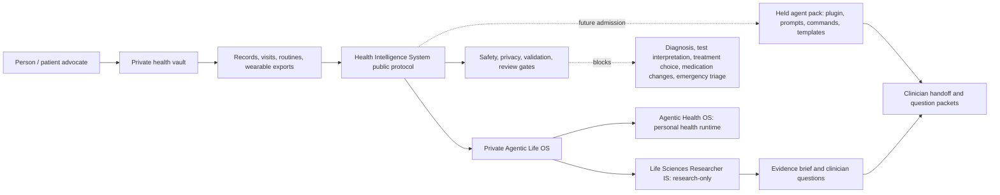

<p align="center">
  
</p>

<h1 align="center">Health Intelligence System</h1>

> **Current foundation status (2026-08-24): non-medical synthetic prerelease.** Every shipped BIOS
> claim is `draft`; every shipped protocol is `draft_synthetic`; protocol execution is blocked; the
> browser preview accepts and stores no data; the reference file vault is an unencrypted synthetic
> test fixture only. Do not use this branch with real health data or for personal guidance.

<p align="center">
  A public evidence, consent, privacy, and safety foundation for future sovereign health tools.
</p>

<p align="center">
  
  <a href="LICENSE"></a>
  <a href="SAFETY.md"></a>
  <a href="VALIDATION.md"></a>
  <a href="AGENT_PACK.md"></a>
</p>

<p align="center">
  <a href="QUICK-START.md">Quick start</a>
  ·
  <a href="SAFETY.md">Safety</a>
  ·
  <a href="MARKETPLACE.md">Distribution</a>
</p>

## What This Is

Health Intelligence System is a public protocol layer for becoming a better health operator and patient advocate. It helps organize private records, wearable exports, doctor visits, clinician questions, evidence sources, cancer-prep workflows, and AI-assisted summaries without pretending to be a doctor.

It is designed to be used in three ways:

| Mode | Use it for | Output |
| --- | --- | --- |
| Human operator | Private vault setup, records, visits, routines, questions | Templates and checklists |
| Coding agent / assistant | Repeatable workflows for setup, redaction, visit prep, handoff, weekly review | Commands, prompts, plugin skill |
| Product runtime | Public safety contract consumed by public Agentic Life OS / Agentic Health OS code and private per-person runtimes | Protocol, package, validation gates |

## BIOS substrate (v0.1)

**BIOS** (Sovereign Health Intelligence Substrate) is currently a safety-contract testbed: schemas,
synthetic fixtures, exact-scope consent/egress compilation, and tamper-evident local audit receipts.
It is not an approved health runtime or system of record.

| Path | What |
| --- | --- |
| [`bios/README.md`](bios/README.md) | Primitives, tiers, quick start |
| [`docs/bios-decision-2026-08-10.md`](docs/bios-decision-2026-08-10.md) | Angles, GitHub landscape, monetization, 100-day plan |
| [`bios/packs/`](bios/packs/) | Non-runnable synthetic fixtures for evidence and safety testing |
| [`bios/registry/public-domain-agents.json`](bios/registry/public-domain-agents.json) | Neutral health stewardship, training, martial movement, culinary botanicals, and complementary-practice education contracts |
| [`bios/knowledge/idea-sources/`](bios/knowledge/idea-sources/) | Copyright-safe discovery metadata; not admitted evidence |
| [`bios/templates/t0-chatgpt-project-pack.md`](bios/templates/t0-chatgpt-project-pack.md) | Grandma / phone-first operator pack |
| [`commands/bios-vault.md`](commands/bios-vault.md) | Agent command |
| [`apps/bios-steward`](apps/bios-steward) | Read-only synthetic preview: no input, storage, start, handoff, upload, or export; excluded from release packaging |

```bash
PYTHONPATH=bios/src python -m unittest discover -s bios/tests -v
PYTHONPATH=bios/src python -m bios_substrate init --household synthetic-demo --subject synthetic --path ./_local/synthetic-demo
PYTHONPATH=bios/src python -m bios_substrate validate --vault ./_local/synthetic-demo
```

The generated vault is plaintext and contractually marked `synthetic_plaintext_prototype`. Never
enter real names, notes, images, wearable data, medical records, or other personal information.

Mind / psychology / neuroscience repos are **future domain packs** over one ledger — not N interconnected systems. See consolidation map.

## Vertical Packs

| Vertical | Audience | Public core | Private / licensed layer |
| --- | --- | --- | --- |
| [BIOS packs](bios/packs/) | Individuals + family stewards | Protocol format, claims, CLI, T0–T3 tiers | Premium curated packs / steward hosting later |
| [Gut Intelligence System](verticals/gut-intelligence-system/) | Parents, qualified nutrition teams, family-health products | Family context, safety gates, ordinary meal journey, weekly review, coach handoff, evidence receipts | Microbiome interpretation, proprietary science mappings, identifiable family state, branded product and coaching operations |

The gut vertical includes the installable [`gut-family-journey`](plugins/health-intelligence-system/skills/gut-family-journey/) skill, machine-readable schemas, fictional fixtures, and executable safety evaluations. It does not interpret raw microbiome data or provide medical nutrition therapy.

It does not diagnose, interpret labs or imaging, prescribe, choose treatment, change medication, dose supplements, triage emergencies, or replace clinicians.

## Release status

The current branch is source-first and verification-only. It does not publish a supported ZIP,
installable health agent, or deployable health product. Existing `v0.2.1` GitHub artifacts predate
the 2026-08-24 evidence and runtime gates and must be treated as legacy review material, not as an
approved distribution.

| Artifact | Current state | Permitted use | Gate to reopen |
| --- | --- | --- | --- |
| BIOS source | Open review and synthetic conformance testing | Fictional data only | Clean-commit package verification plus independent review |
| Legacy full package | Historical inspection | Do not use with real data or for guidance | Rebuild from the admitted allowlist |
| Legacy agent pack | Historical inspection | Do not install or run as a health assistant | Full prompt, command, skill, privacy, and clinical-boundary audit |
| Source repo | GitHub review, issues, pull requests, forks | Public engineering collaboration; never personal records | Continuous safety and privacy review |

After creating one clean, reviewed candidate commit, maintainers can verify the minimal synthetic
BIOS archive locally:

```powershell
npm run package:release
npm run verify:release
```

## Legacy install surfaces — hold

The following files remain visible for audit and migration planning. They are not admitted by the
current BIOS safety contract and are not install recommendations.

| Surface | Path | Historical target |
| --- | --- | --- |
| Codex plugin | [`plugins/health-intelligence-system/`](plugins/health-intelligence-system/) | Codex plugin directory |
| Sovereign Health Operator skill | [`plugins/health-intelligence-system/skills/sovereign-health-operator/`](plugins/health-intelligence-system/skills/sovereign-health-operator/) | Codex, local skill runners |
| ChatGPT Project prompt | [`prompts/chatgpt-project-system-prompt.md`](prompts/chatgpt-project-system-prompt.md) | ChatGPT Projects |
| Custom GPT instructions | [`prompts/custom-gpt-instructions.md`](prompts/custom-gpt-instructions.md) | Custom GPT builder |
| Claude Project prompt | [`prompts/claude-project-prompt.md`](prompts/claude-project-prompt.md) | Claude Projects |
| Local redaction prompt | [`prompts/local-llm-redaction-prompt.md`](prompts/local-llm-redaction-prompt.md) | Local LLM privacy review |
| Slash commands | [`commands/`](commands/) | Coding agents, local automation |
| Private vault templates | [`templates/`](templates/) | Obsidian, local folders, encrypted workspace |

Review [`AGENT_PACK.md`](AGENT_PACK.md) for the explicit legacy hold and future admission gate.

## System Architecture


```mermaid
flowchart LR
  user["Person / patient advocate"] --> vault["Private health vault"]
  vault --> records["Records, visits, routines, wearable exports"]
  records --> his["Health Intelligence System public protocol"]
  his -. future admission .-> agent["Held agent pack: plugin, prompts, commands, templates"]
  agent --> handoff["Clinician handoff and question packets"]
  his --> safety["Safety, privacy, validation, review gates"]
  his --> alos["Private Agentic Life OS"]
  alos --> ahos["Agentic Health OS: personal health runtime"]
  alos --> lsr["Life Sciences Researcher IS: research-only"]
  lsr --> brief["Evidence brief and clinician questions"]
  brief --> handoff
  safety -. blocks .-> blocked["Diagnosis, test interpretation, treatment choice, medication changes, emergency triage"]
```

## Product Boundary

| Layer | Public or private | Job | Must not hold |
| --- | --- | --- | --- |
| Health Intelligence System | Public | Evidence/safety contracts, synthetic BIOS candidate, and future admitted packages | Raw personal health records |
| Agentic Life OS / Agentic Health OS code | Public reference implementation | Reusable product UX, safety routing, fictional fixtures | Real patient data, private memory, live vaults |
| Private encrypted runtime | Local/private per person | Personal organization, consent, nutrition/training/wellness logs, visit prep, private vault orchestration | Public Git, CI, previews, or analytics |
| Life Sciences Researcher IS | Public research-only code, synthetic data | Literature, trials, mechanisms, biomedical evidence envelopes | Personal records or care decisions |
| Clinician interface | User-reviewed export | Questions, timelines, source ledger, handoff packet | Unreviewed diagnosis or treatment advice |

Read the full boundary in [`docs/product-boundary.md`](docs/product-boundary.md), [`docs/public-core-private-runtime-boundary.md`](docs/public-core-private-runtime-boundary.md), and [`docs/agentic-life-os-integration.md`](docs/agentic-life-os-integration.md).

## Legacy workflow inventory — hold

These public files remain available for review, but the current research preview does not admit or
package them as executable health-agent workflows.

| Workflow | Command | Template | Boundary |
| --- | --- | --- | --- |
| Private vault setup | [`commands/private-health-instance-setup.md`](commands/private-health-instance-setup.md) | [`templates/private-vault-manifest.md`](templates/private-vault-manifest.md) | Public repo never stores real records |
| Doctor visit prep | [`commands/doctor-visit-prep.md`](commands/doctor-visit-prep.md) | [`templates/doctor-visit-prep.md`](templates/doctor-visit-prep.md) | Questions, not diagnosis |
| Clinician handoff | [`commands/clinician-handoff-export.md`](commands/clinician-handoff-export.md) | [`templates/clinician-handoff-export.md`](templates/clinician-handoff-export.md) | User-reviewed export only |
| Wearable ingestion | [`commands/wearable-data-ingestion.md`](commands/wearable-data-ingestion.md) | [`templates/wearable-data-ingestion-manifest.md`](templates/wearable-data-ingestion-manifest.md) | Trends are not medical interpretation |
| Weekly review | [`commands/health-optimization-weekly-review.md`](commands/health-optimization-weekly-review.md) | [`templates/health-operator-weekly-review.md`](templates/health-operator-weekly-review.md) | Self-tracking, not prescription |
| Possibility map | [`commands/health-possibility-map.md`](commands/health-possibility-map.md) | [`templates/health-possibility-map.md`](templates/health-possibility-map.md) | Possibilities to discuss, not answers |
| Privacy preflight | [`commands/privacy-preflight-redaction.md`](commands/privacy-preflight-redaction.md) | [`templates/ai-sanitized-context-export.md`](templates/ai-sanitized-context-export.md) | AI redaction is never the only barrier |
| Cancer prep | [`docs/cancer-detection-prep-treatment.md`](docs/cancer-detection-prep-treatment.md) | cancer templates in [`templates/`](templates/) | Care team owns clinical decisions |

## Repository Map

```text
.
|-- assets/                         # README banner and public visuals
|-- commands/                       # Slash-command style operator workflows
|-- docs/                           # Architecture, safety, evidence, integration, research boundary
|-- plugins/health-intelligence-system/
|   `-- skills/sovereign-health-operator/
|-- prompts/                        # ChatGPT, Custom GPT, Claude, local redaction prompts
|-- scripts/                        # Release and agent-pack packaging/verification
|-- templates/                      # Private-vault and clinician-handoff templates
|-- AGENT_PACK.md                   # Installable pack guide
|-- MARKETPLACE.md                  # Distribution and marketplace path
|-- SAFETY.md
|-- PRIVACY.md
|-- VALIDATION.md
`-- REVIEW-GATE.md
```

## Documentation Index

| Need | Start here |
| --- | --- |
| Historical operator setup (held) | [`QUICK-START.md`](QUICK-START.md) |
| Safety boundary | [`SAFETY.md`](SAFETY.md) |
| Privacy model | [`PRIVACY.md`](PRIVACY.md) |
| Validation and release checks | [`VALIDATION.md`](VALIDATION.md), [`VERIFY.md`](VERIFY.md) |
| Full architecture | [`docs/architecture.md`](docs/architecture.md) |
| Product split | [`docs/product-boundary.md`](docs/product-boundary.md) |
| Private runtime integration | [`docs/agentic-life-os-integration.md`](docs/agentic-life-os-integration.md) |
| Research boundary | [`docs/companion-research-systems.md`](docs/companion-research-systems.md) |
| Evidence admission and copyright | [`docs/evidence-admission-and-copyright.md`](docs/evidence-admission-and-copyright.md) |
| Vitalis / Velora public-name hold | [`docs/VITALIS-PUBLIC-NAME.md`](docs/VITALIS-PUBLIC-NAME.md) |
| External systems comparison | [`docs/external-systems-comparison.md`](docs/external-systems-comparison.md) |
| Historical agent installation (held) | [`docs/coding-agent-installation-guide.md`](docs/coding-agent-installation-guide.md) |
| Historical prompt pack (held) | [`docs/prompt-pack-chatgpt-claude.md`](docs/prompt-pack-chatgpt-claude.md) |
| Wearable data | [`docs/wearable-data-ingestion-and-privacy.md`](docs/wearable-data-ingestion-and-privacy.md) |
| Cancer prep | [`docs/cancer-detection-prep-treatment.md`](docs/cancer-detection-prep-treatment.md) |

## Safety Contract

Not medical advice. This repository is an organizational and agent-workflow system for patient advocacy, privacy, records, questions, and clinician handoff.

Allowed:

- organize records, timelines, questions, and routines;
- summarize user-provided facts without adding medical conclusions;
- prepare doctor-visit agendas and clinician handoff packets;
- track source dates and evidence provenance;
- create privacy-reviewed context exports for optional AI use;
- translate research into questions for qualified clinicians.

Blocked:

- diagnosis or reassurance that something is not serious;
- lab, imaging, pathology, genomic, or wearable medical interpretation;
- medication, supplement, dosing, fasting, rehab, or treatment recommendations;
- emergency triage or advice to delay care;
- storing private health records in public git history.

If a person has symptoms, abnormal tests, suspected cancer, confirmed cancer, severe side effects, or urgent concerns, this system routes them to qualified care.

## Release Quality

Every public release should have:

- versioned ZIP files;
- checksums and manifests;
- safety-critical docs in the package;
- no secrets, private health data, or local-machine paths;
- install path, first workflow, and support/upgrade path;
- clinical/legal review gate clearly marked.

This repo uses:

```powershell
npm run package:all
npm run verify:release
```

## Built On

Health Intelligence System adopts the SIP file contract, sovereignty clause, attestation pattern, and composition discipline from Starlight Intelligence System.

The banner image was generated with the built-in GPT image generation workflow and saved into this repository at [`assets/health-intelligence-system-banner.png`](assets/health-intelligence-system-banner.png).

**Built on SIP** - Starlight Intelligence Protocol v1.1.1
