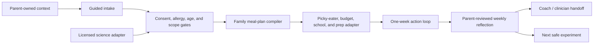

# Gut Intelligence System

Gut Intelligence System is an open-core vertical for turning approved nutrition and microbiome-science inputs into a safe, practical family action loop.

It is designed for parents, nutrition coaches, pediatric dietitians, and product teams building guided journeys around children's meals. It helps structure context, plan ordinary family meals, adapt for real-life constraints, review weekly patterns, and prepare a coach handoff.

It does not diagnose, interpret microbiome or medical test results, prescribe diet therapy or supplements, or replace a qualified clinician.

## Start Here

1. Read the [task envelope](task-envelope.json) and [open-core boundary](open-core-boundary.md).
2. Capture only the minimum family context with [`templates/gut-family-context.md`](../../templates/gut-family-context.md).
3. Run the [`gut-family-onboarding`](../../commands/gut-family-onboarding.md) workflow.
4. Build a conservative first week with [`gut-first-week-plan`](../../commands/gut-first-week-plan.md).
5. Review what actually happened with [`gut-weekly-review`](../../commands/gut-weekly-review.md).
6. Export questions and observations with [`gut-coach-handoff`](../../commands/gut-coach-handoff.md).

The installable agent surface lives in [`plugins/health-intelligence-system/skills/gut-family-journey`](../../plugins/health-intelligence-system/skills/gut-family-journey/).

## System Loop

The public core accepts only an approved interpretation envelope from a science adapter. Raw microbiome data, proprietary mappings, clinical rules, and identifiable family records stay outside the public core.

## Open-Core Components

- JSON Schemas for family context, approved science inputs, plan output, and evidence receipts.
- Deterministic authority, privacy, allergy, scope, and claims gates.
- Parent-facing workflow commands and templates.
- A portable `gut-family-journey` skill.
- Fictional fixtures and executable safety evaluations.
- A product-adapter contract that lets a qualified partner supply validated science without exposing it.

## Intended Product Layers

| Layer | Owner | Purpose |
| --- | --- | --- |
| Public core | Health Intelligence System | Workflow contract, schemas, safety gates, templates, evals |
| Licensed science adapter | Qualified science partner | Approved interpretation, evidence mapping, claims library |
| Private family runtime | Product operator / family | Consent, profile, journey state, coach messages, personal records |
| Coach console | Qualified service team | Human review, exceptions, handoff, longitudinal support |

## Release Status

This vertical is a public technical prerelease. It requires qualified clinical, nutrition, privacy, and legal review before use in a consumer health product.

**Built on SIP** - Gut Intelligence System vertical v0.1
